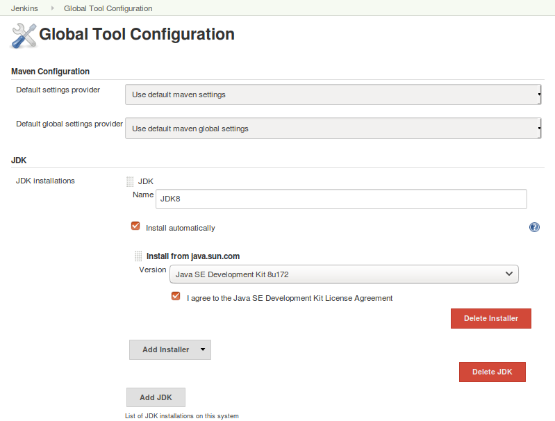
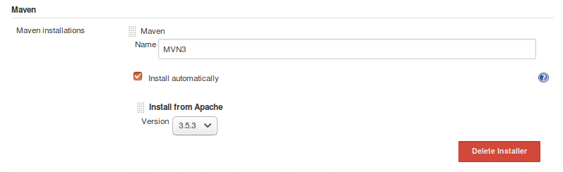
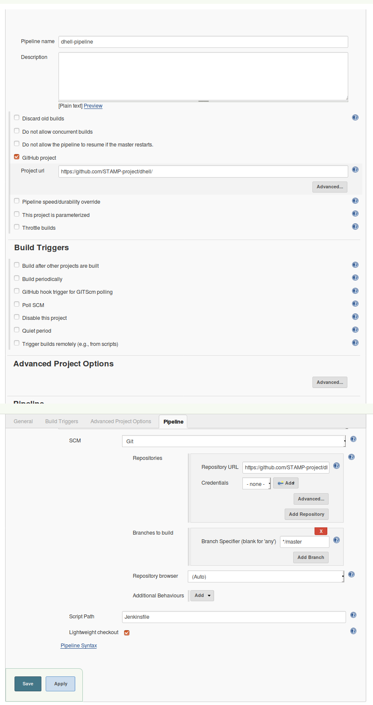

# Execute PIT Descartes in a Jenkins pipeline
In [this file](https://github.com/STAMP-project/dhell/blob/master/Jenkinsfile) is defined a simple Jenkins pipeline job that build and execute pit descartes  on a maven project.
In the next sections are described the steps to install Jenkins, configure and run the pipeline job.

## Jenkins Intallation
* Install Jenkins (as descibed [on this page](https://jenkins.io/doc/book/installing/))
* Install the [suggested plugins](https://github.com/jenkinsci/jenkins/blob/jenkins-2.119/core/src/main/resources/jenkins/install/platform-plugins.json)
* Install [HTML Publisher plugin](https://plugins.jenkins.io/htmlpublisher)

## Jenkins Configuration:
From *Global Tool Configuration* configure:
* a JDK installation named *JDK8*

* a Maven installation named *MVN3*

## DHELL pipeline Job deinition
Create a Jenkins pipeline job:
* "Pipeline name": dhell-pipeline
* "GitHub project": true and set "Project url" to https://github.com/STAMP-project/dhell/
* Set Pipelne Properties to:
	* "definition": "Pipeline script from SCM"
	* "SCM": git
	* "Repositories">"Repository URL":https://github.com/STAMP-project/dhell/
	* "Script Path": Jenkinsfile

## Execute the pipeline
* Execute "dhell-pipeline" job
* Check pit report result
